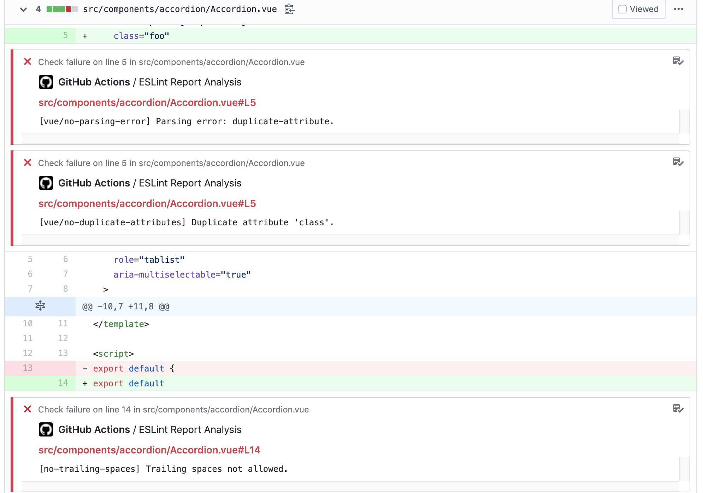
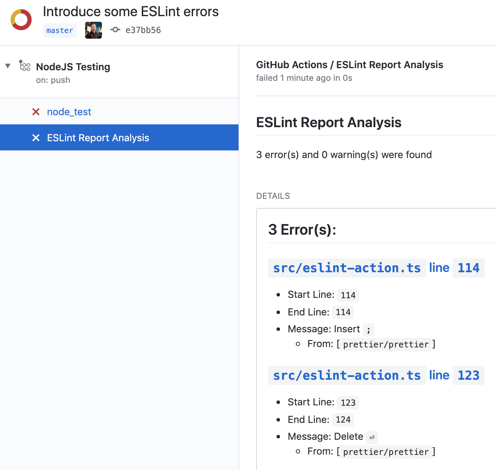

[](https://docs.stepsecurity.io/actions/stepsecurity-maintained-actions)

# ESLint Annotate from Report JSON


## Description

Reads an ESLint JSON report file and posts the results as GitHub Check annotations.

On `pull_request`, annotates the diff with warnings and errors:



On `push`, creates an `ESLint Report Analysis` check with a full summary including links to each violation:



## Why another ESLint action?

This action does not run ESLint itself — it processes a report JSON file you produce however you like. That makes it agnostic to your ESLint config, plugins, and execution environment.

## Requirements

- **Node 24** on your runner (or use `actions/setup-node` with `node-version: '24'`)
- Workflow permissions: `checks: write` (required), `pull-requests: read` (required for `only-pr-files` or `post-comment`)

## Inputs

| Name | Description | Required | Default |
|---|---|---|---|
| `github-token` | The [`GITHUB_TOKEN` secret](https://docs.github.com/en/actions/security-guides/automatic-token-authentication) | Yes | — |
| `report-json` | Path or [glob pattern](https://github.com/actions/toolkit/tree/master/packages/glob) to the ESLint JSON report file. Multiple lines = multiple patterns, results are merged. | No | `eslint_report.json` |
| `only-pr-files` | Only annotate files changed in the pull request (ignored on non-`pull_request` events) | No | `true` |
| `fail-on-warning` | Fail the check when ESLint warnings are detected | No | `false` |
| `fail-on-error` | Fail the check when ESLint errors are detected | No | `true` |
| `neutral-on-warning` | Set check conclusion to `neutral` (instead of `success`) when there are warnings but no errors and `fail-on-warning` is `false` | No | `false` |
| `check-name` | Name of the GitHub Check created | No | `ESLint Report Analysis` |
| `markdown-report-on-step-summary` | Write the markdown summary to the GitHub Actions job summary | No | `false` |
| `post-comment` | Post (or replace) a PR comment with the ESLint summary | No | `false` |

## Outputs

| Name | Description |
|---|---|
| `summary` | Short description of the error and warning counts |
| `errorCount` | Number of ESLint errors |
| `warningCount` | Number of ESLint warnings |

## Usage

### Basic example

```yaml
name: Node.js CI

on: [pull_request, push]

jobs:
  lint:
    runs-on: ubuntu-latest
    permissions:
      checks: write
      pull-requests: read

    steps:
      - uses: actions/checkout@v7

      - uses: actions/setup-node@v6
        with:
          node-version: '24'
          cache: npm

      - run: npm ci

      - name: Save ESLint report
        run: npm run lint:report
        continue-on-error: true

      - name: Annotate ESLint results
        uses: step-security/eslint-annotate-action@v4
        with:
          github-token: ${{ secrets.GITHUB_TOKEN }}
```

> The `lint:report` npm script should run ESLint with `--output-file eslint_report.json --format json`. For example:
> ```json
> "lint:report": "eslint --output-file eslint_report.json --format json src"
> ```

### With PR comment

Post a sticky comment on pull requests summarising the ESLint results. The comment is replaced on each run so the PR stays clean.

```yaml
      - name: Annotate ESLint results
        uses: step-security/eslint-annotate-action@v4
        with:
          github-token: ${{ secrets.GITHUB_TOKEN }}
          post-comment: true
```

### Treat warnings as neutral (not success)

```yaml
      - name: Annotate ESLint results
        uses: step-security/eslint-annotate-action@v4
        with:
          github-token: ${{ secrets.GITHUB_TOKEN }}
          neutral-on-warning: true
```

### Multiple report files (glob)

```yaml
      - name: Annotate ESLint results
        uses: step-security/eslint-annotate-action@v4
        with:
          github-token: ${{ secrets.GITHUB_TOKEN }}
          report-json: |
            packages/*/eslint_report.json
            apps/*/eslint_report.json
```

### Save a copy of the report as an artifact

```yaml
      - name: Annotate ESLint results
        uses: step-security/eslint-annotate-action@v4
        with:
          github-token: ${{ secrets.GITHUB_TOKEN }}

      - name: Upload ESLint report
        uses: actions/upload-artifact@v7
        with:
          name: eslint_report.json
          path: eslint_report.json
          retention-days: 5
```


